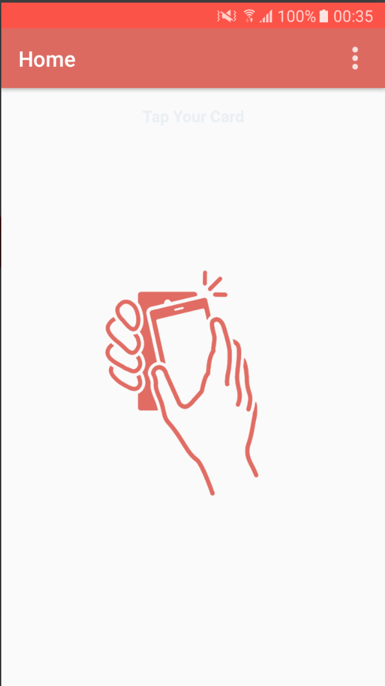
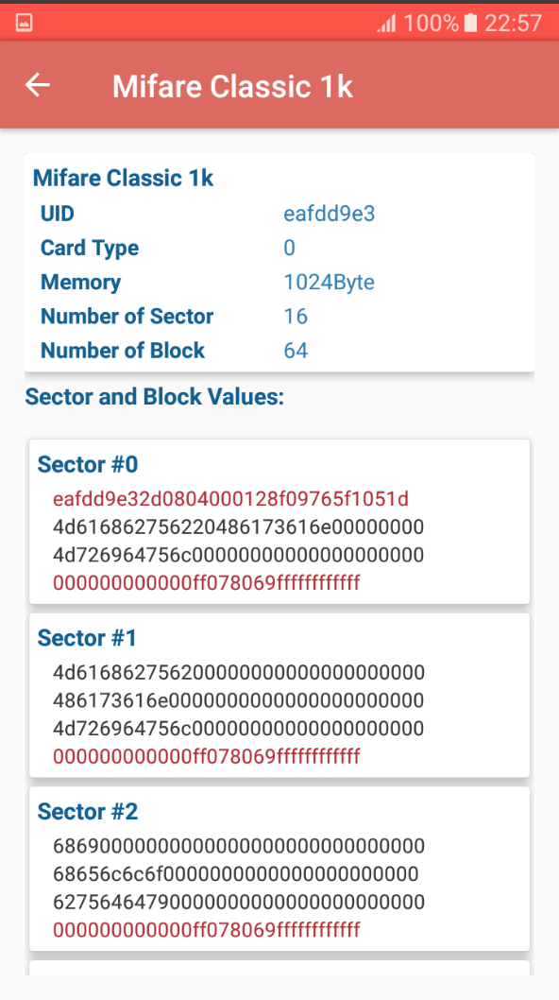
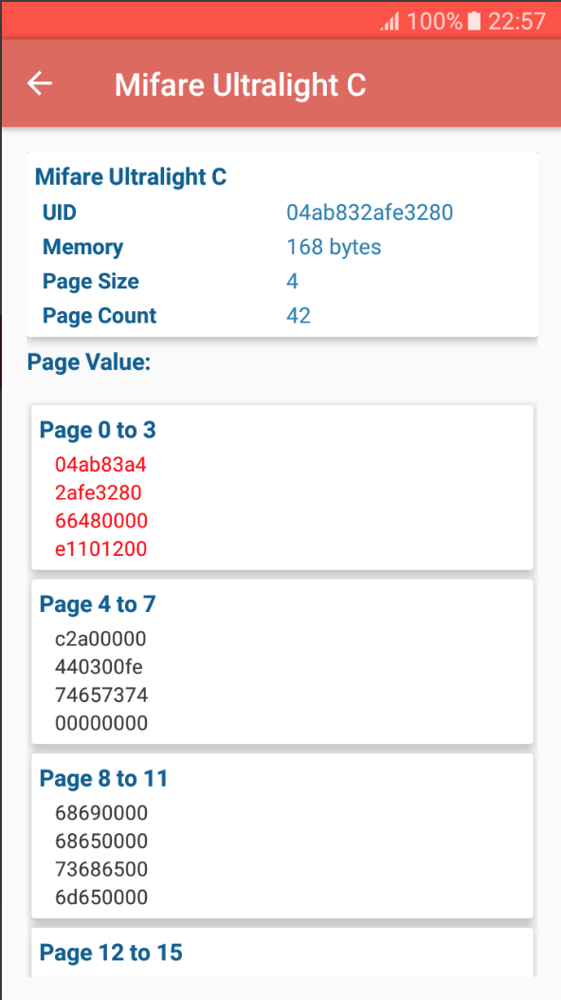

NFC-UTILS
=========
# Touch Card

# Mifare Classic 1k 

# Mifare Ultraght C

*It will Read Mifare Ultralight ,  Mifare Ultralight C and Mifare Classic 1k Tag Id , Page Data.
*It will also act as NFC Reader and NFC Writter for Mifare Ultralight , Mifare Ultraght C and NTAG 203. It also NFC Reader and NFC Writter For Mifare Classic 1K.
*It will Write Mifare Mifare Ultralight , Ultralight C and Mifare Classic 1k Tag on specefic Page.
*Due to lacks of others NFC Tags we are not able to experiment on others taga.
The google play Link of this Application is
https://play.google.com/store/apps/details?id=com.nfcutils.app

